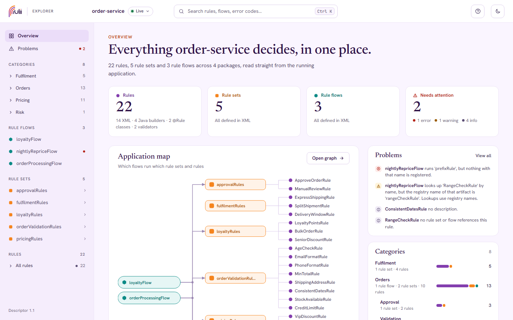
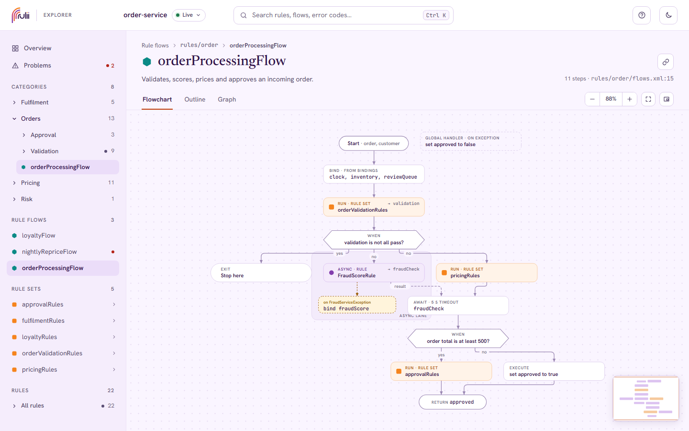
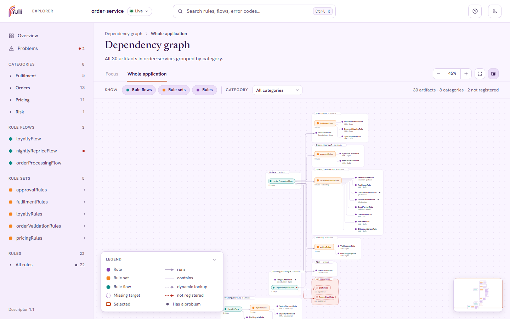
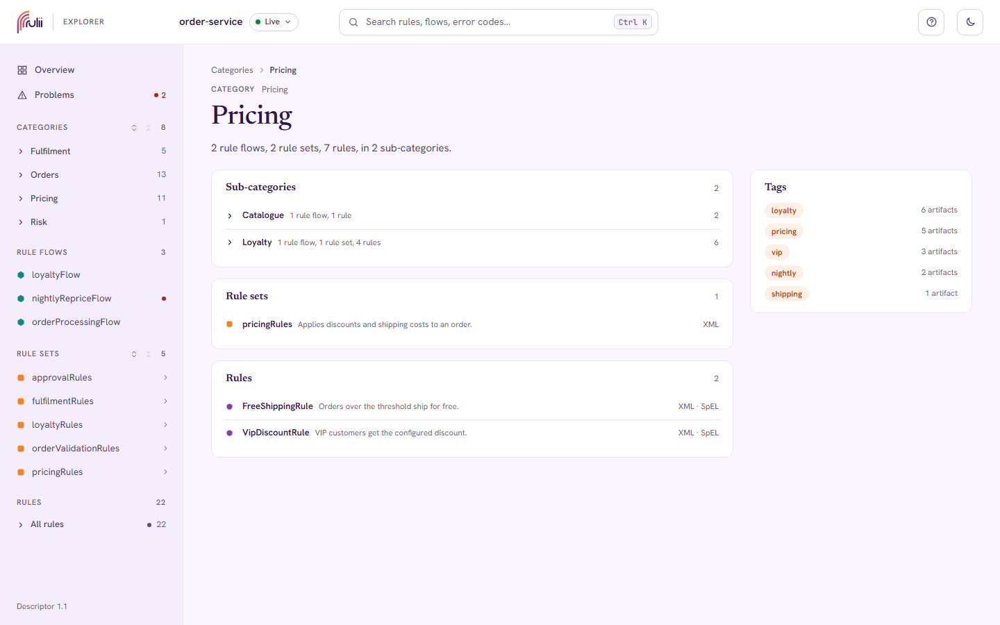
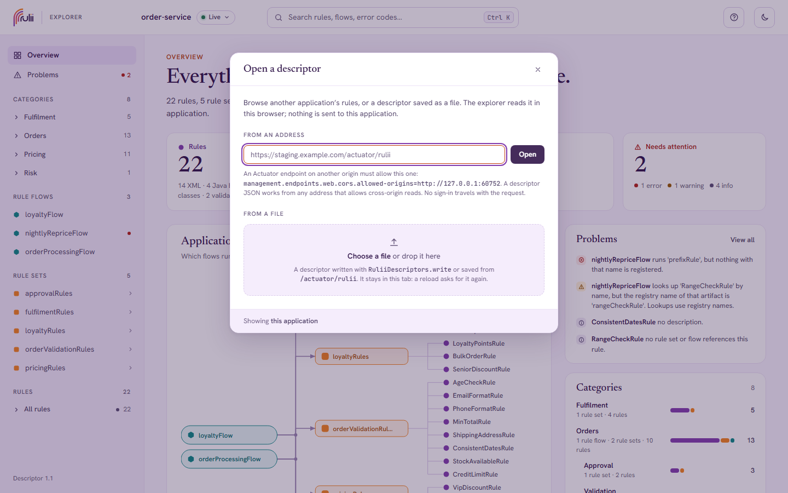
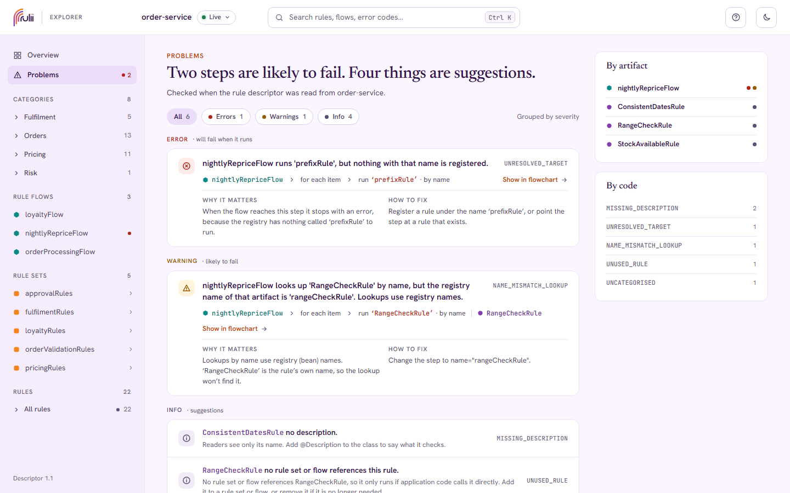

# Using the rulii explorer

The explorer shows the rules, rule sets and rule flows of a running [rulii](https://www.rulii.org)
application: what each one checks or does, in plain English, how they fit together, and what is
likely to fail. It is read-only. Everything on screen comes from the application's rule
descriptor, and the explorer never guesses: where logic is compiled Java code it says so, and
configuration placeholders are shown as written, with their default. The value a placeholder
resolved to appears only when the application chose to share it (see "Placeholder values" below).

It lives at `/rulii` once the application has `rulii.explorer.enabled=true` and exposes the
`rulii` Actuator endpoint. [README.md](README.md) covers setup, security and configuration; this
guide covers using the screens. Press `?` on any screen for the short version.



## The tour

- **Top bar**: the application name, the search field (`Ctrl K`, `⌘ K` or `/`), help (`?`) and
  the light/dark switch. The theme follows the operating system until you choose.
- **Sidebar**: Overview and Problems, then every rule flow, every rule set, and the rules grouped
  by the package they are defined in. A coloured dot next to a name is its worst problem; "not
  described" means the artifact's definition could not be read.
- **Overview**: the counts, the application map of which flows run which rule sets and rules,
  the problems, and the packages with what each one holds.
- **A rule**: one sentence saying what it checks, then the condition and actions as plain text or
  the raw expression (the Plain / Raw switch, remembered), its parameters, the bindings it reads
  and writes, who uses it, and where it is defined. Validators show their error code, message and
  settings. A rule whose logic is compiled code shows its signature and says so.
- **A rule set**: its rules in order with their conditions, the stop condition if there is one,
  and who runs it.
- **A rule flow**: a flowchart, an outline (the same steps as text) and a link to the graph.
  Clicking a step opens its panel on the right; the selection is shared between the two views.
- **The dependency graph**: focused on one artifact and everything one, two or any number of
  steps away, or the whole application grouped by package.
- **A binding**: who writes it, who reads it, which properties of it, and where compiled code
  might also change it.
- **A package**: what it defines, with the same dots and kinds as the sidebar.
- **Problems**: everything the checks found, grouped by severity, each with why it matters and
  how to fix it.

Hovering any artifact link shows a card with its type, kind and summary.

## Rule flows



The flowchart is laid out top to bottom, one node per step:

- **Step**: a rounded box, coloured by what it runs (rule, rule set or rule flow) with the type
  glyph. The caption says how: RUN, APPLY, ASYNC, AWAIT, BIND, EXECUTE. "→ name" on the right
  means the result is kept under that name for later steps.
- **Decision**: a six-sided box. WHEN leaves along *yes* and *no*; FOR EACH runs its box once per
  item and leaves along *done*.
- **Box**: a scope or the body of a loop, with its name as a label. Steps inside share its
  bindings.
- **Async lane**: a tinted area holding the steps that run in the background and their handlers.
  A dashed *result* edge joins each one to the AWAIT that waits for it.
- **Handler**: a dashed amber box hanging off its step, labelled with the exception it catches.
  A global handler, which catches whatever any step throws, sits on its own.
- **Exit**: a pill that stops the flow here, with or without a value. Start, Return and End are
  pills too: Start lists the flow's parameters, Return shows the expression.
- **Not registered**: a red dashed box. Nothing with that name exists, so the step fails when it
  runs. Problems says how to fix it.
- **Dashed outline**: the target is looked up by name or class from the registry when the flow
  runs, rather than wired directly.
- **Lock**: compiled code whose logic cannot be read. **Dot**: a step with a problem, coloured by
  severity; hover for the message.

Drag to pan, use the wheel to zoom, and press `F` (or the fit button) to fit the drawing to the
screen. The minimap in the corner can be hidden. The outline shows the same steps numbered
(`2.1` is the first step inside step 2), with the same step panel and a Plain / Raw switch for the
expressions. Exception handlers and the finalizer are listed at the bottom under "Whenever a step
fails".

## The dependency graph



**Focus** shows one artifact and its neighbourhood: one step away, two, or everything connected.
**Whole application** shows every artifact, grouped by package while the application is small
enough to lay out that way, otherwise flat with flows on the left and rules on the right. The
filters hide types or keep one package. Click a node for its panel; double-click to focus on it;
the legend in the corner explains the edges. A red dashed node is a target that is not
registered. Selection, focus and depth are all in the address, so a view can be shared.

## Search

`Ctrl K`, `⌘ K` or `/` opens the search over everything: names, conditions, error codes and
binding paths. Results are grouped by type with the match underlined; `Tab` cycles the type
filter, `↑` `↓` move, `↵` opens, `Esc` closes. Camel-case prefixes work: `ordervalidation` finds
`orderValidationRules`. `tag:vip` and `in:Pricing` narrow the results to a tag or a category
(see "Categories and tags"); on their own they list everything that matches.

## Categories and tags



Rules, rule sets and flows can say where they belong and what they are about, and the explorer
organises itself around that instead of around packages and class names:

- A **category** is the one place an artifact lives, such as `Pricing` or `Pricing/Loyalty`
  (`/` separates the levels). When an application uses categories, the sidebar opens with the
  category tree, each category opening into its sub-categories and its artifacts; the overview
  lists the categories with their counts; the whole-application graph draws a box per category;
  and the breadcrumb of every page shows the category instead of the package. Each category has
  a page at `#/category/{path}`. A rule with no category of its own that belongs to exactly one
  rule set with a category is shown under that set's, marked *via* the set, since a member of a
  Pricing set is a pricing rule. Anything else without a category sits under **Uncategorised**,
  and the Problems page lists it as `UNCATEGORISED`.
- **Tags** are short labels, any number per artifact, shown as chips under the description.
  Click one to search for everything that carries it. In the search, `tag:vip` keeps only
  artifacts with that tag, `in:Pricing` only those in that category and the ones below it (a
  level prefix works: `in:loyal`), and both combine with ordinary words.

Declaring them, in XML:

```xml
<r:defaults category="Pricing" tags="pricing"/>          <!-- for every artifact in this file -->
<r:rule name="VipDiscountRule" tags="vip" description="…"> …
<r:ruleflow name="nightlyRepriceFlow" category="Pricing/Catalogue" tags="nightly"> …
```

An element's `category` replaces the file default; its `tags` are added to the default's. On a
`@Rule` class, `@Category("Pricing")` and `@Tags({"vip", "discount"})` sit beside `@Description`;
in the builders, `.category("Pricing").tags("vip")`. Nothing is ever inferred from a package or
a file name. Without any categories the sidebar falls back to grouping rules by the rule set that
runs them, with the ones in no rule set listed separately, and the overview shows where artifacts
are defined instead.

## Opening another descriptor



The chip next to the application name in the top bar says where the rules come from: **Live**
is this application's own descriptor. Click it (or choose *open a descriptor* in the search
footer) to look at something else:

- **Another application's descriptor, by address.** Enter its `/actuator/rulii` address. The
  explorer fetches it from your browser, so the other application has to allow this origin to
  read it: `management.endpoints.web.cors.allowed-origins=https://where-this-explorer-runs`.
  No sign-in travels with the request, so a protected endpoint has to be saved as a file instead.
  The chip then names the host, and the address carries the choice:
  `/rulii?descriptor=https://staging:8080/actuator/rulii#/rule/MinTotalRule`, so it reloads and
  can be shared.
- **A descriptor saved as a JSON file**, from any address that allows cross-origin reads, the
  same way.
- **A file from your machine.** Choose it in the dialog or drop it anywhere on the page. It stays
  in this browser tab; after a reload the explorer asks for it again.

**Back to this application** in the dialog returns to the live descriptor. Everything else works
the same with any source. The application can turn the feature off with
`rulii.explorer.ui.external-sources=false`; the chip is then absent and the address parameter is
ignored.

## Keyboard

| Keys | What happens |
|---|---|
| `Ctrl K`, `⌘ K` or `/` | Open the search |
| `Tab`, `⇧ Tab` | In the search, cycle the type filter |
| `↑` `↓` `↵` | Move through the results and open one |
| `Esc` | Close the search, the help sheet or a panel |
| `?` | The help sheet |
| `F` | Fit a flowchart or graph to the screen |
| `Tab` then `↵` or `Space` | Select a flowchart step or a graph node; its panel opens on the right |

Everything else is reachable with `Tab`, including the sidebar, the tabs and the outline steps.

## Addresses

Every screen has an address that survives a reload and can be pasted into a review or a chat.
**Copy link** on a page puts it on the clipboard, including the current selection.

| Address | Screen |
|---|---|
| `#/` | Overview |
| `#/problems?severity=error` | Problems, filtered by `error`, `warning` or `info` |
| `#/rule/{id}`, `#/ruleset/{id}`, `#/ruleflow/{id}` | An artifact, by its registry name |
| `#/ruleflow/{id}?view=outline&step=commands[1]` | A flow as `flowchart` or `outline`, with a step selected |
| `#/graph?focus={id}&depth=2` | The graph around an artifact; `depth` is `1`, `2` or `all` |
| `#/graph?selected={id}` | The whole application with one artifact selected |
| `#/binding/{name}` | A binding |
| `#/package/{id}` | A package |
| `#/category/{path}` | A category, such as `#/category/Pricing/Loyalty` |
| `?descriptor={url}#/…` | Any screen, read from another application's descriptor or a saved JSON at that address (before the `#`) |

Step addresses follow the flow's structure: `commands[1]` is the second top-level step,
`commands[1].body[0]` the first step inside it, `commands[6].then[0]` the first step of a WHEN's
*yes* branch, `commands[3].handler.body[0]` the first step of that step's handler. Ids with
slashes, such as XML package ids, are encoded.

## Problems



The checks run when the descriptor is built, so the page reflects the application as it is now.
Each problem names the artifact, the step where it applies, why it matters and how to fix it. The
codes are stable, so a CI job can key on them in the JSON. Errors will fail when they run,
warnings are likely to, and info items are suggestions.

### `UNRESOLVED_TARGET` (error)

A flow step runs something by name or by class, and the registry has nothing that matches. When
the flow reaches the step it stops with an error. In the demo, `nightlyRepriceFlow` runs
`prefixRule`, which does not exist.

*Fix*: register a rule under that name (or of that class), or point the step at a rule that
exists. If the rule is a Spring bean, check that the bean name is the one the step uses.

### `UNDESCRIBABLE` (error)

Reading the artifact's definition threw an exception. The explorer shows the artifact with what
it could read, usually only the name, and the sidebar marks it "not described". The rest of the
application is unaffected, and so is the application itself; only the description failed.

*Fix*: the message is the exception from the application. Fix the definition it points at, or
report it to the rulii project if the definition looks right.

### `NAME_MISMATCH_LOOKUP` (warning)

A step looks something up by name, and that name is an artifact's own name but not its registry
name. Lookups use registry names, which for Spring beans is the bean name, so the lookup will not
find it. In the demo, a step names `RangeCheckRule` while the bean is `rangeCheckRule`.

*Fix*: change the step to the registry name. The problem's message says which one.

### `DUPLICATE_NAME` (warning)

Two artifacts have the same own name. Lookups by that name are ambiguous, and so is any
conversation about "the X rule".

*Fix*: give each artifact a distinct name.

### `UNUSED_RULE` (info)

A registered rule that no rule set or flow references. It only runs if application code calls it
directly, which the explorer cannot see.

*Fix*: add it to a rule set or flow, or remove it if it is no longer needed. If application code
does call it, there is nothing to do.

### `MISSING_DESCRIPTION` (info)

The artifact has no description, so readers see only its name and the generated summary.

*Fix*: add `@Description` to a `@Rule` class, a `description` attribute in XML, or the
description in the builder.

### `UNCATEGORISED` (info)

The application files its artifacts by category, and this one declares none. It shows under
*Uncategorised*, or under its rule set's category when it belongs to exactly one that has one.
An application that never categorised anything gets none of these, so they appear only once
categories are adopted.

*Fix*: add `@Category` to a `@Rule` class, a `category` attribute in XML (or
`<r:defaults category="…"/>` for the whole file), or `.category("…")` in the builder.

## Vocabulary

- **Artifact**: a rule, rule set or rule flow. The glyphs are a circle (rule), a rounded square
  (rule set) and a hexagon (rule flow); a dashed circle is an artifact that could not be
  described.
- **Registry name** and **name**: the registry name is how rulii, and every lookup, finds an
  artifact; for Spring beans it is the bean name. The name is what the artifact calls itself.
  They usually agree. When they do not, pages show "bean *registryName*" next to the title.
- **Inline, not a bean**: a rule defined inside a rule set or flow rather than registered on its
  own. Its id is a path, such as `orderRules/members[2]`.
- **Kind**: how an artifact was built, and in which language. `XML · SpEL`, `XML · JavaScript`
  or `XML · Java` is an XML rule with an expression in that language, `@Rule class` a Java class,
  `Validator · r:email` a predefined validator, `Java builder · SpEL` (or another language) a rule
  built in Java code with an expression, `Java builder · lambda` one with compiled code. The
  language also sits beside the Plain / Raw toggle on the rule page, and a small `js` or `java`
  tag marks rules that are not SpEL in the sidebar and the search, since SpEL is rulii's default.
  A rule whose expressions use different languages says `mixed`.
- **Category** and **tags**: where an artifact belongs (one, hierarchical with `/`) and what it
  is about (any number), declared by the application. See "Categories and tags" above. A
  **package** is where it is defined, a technical fact kept on the Source card, the package page
  and the breadcrumb of uncategorised artifacts.
- **Compiled code**: a lambda or method reference. The explorer shows its signature and the
  bindings it declares, and says that its logic cannot be read. A lock marks it everywhere.
- **Plain** and **Raw**: the same expression as a sentence or as the original text with syntax
  colours. SpEL, JavaScript and Java all read as sentences; a part the explorer cannot phrase, such as
  a function or a regular expression, is shown as written and the page says the translation is
  partial. Bindings become chips that link to the binding page; placeholders such as
  `${order.minTotal:100}` become chips showing the key and the default.
- **Placeholder values**: off by default, the chip shows `order.minTotal` with `default 100` and
  the rule page says the value stays private. When the application sets
  `rulii.explorer.placeholders.show-values=always`, the chip reads `order.minTotal = 150` (the
  default stays beside it when it differs) and the raw view adds a small `→ 150` after the
  placeholder, outside the copied text. The value is the one the rule compiled with, read from
  the running application, not a lookup at request time. A key the application excluded
  (`rulii.explorer.placeholders.exclude`, secrets by default) keeps its chip with a lock and the
  note names it. The help sheet and the sidebar say nothing about values: look at a rule with a
  placeholder.
- **Binding**: a named value that rules read or write. The binding page lists both sides, and
  notes where compiled code might also change it.
- **Lookup**: a flow step that finds its target by name or by class when it runs, rather than
  holding it directly. "Direct" steps are wired at build time.
- **Sources**: the file and line, or the class, where an artifact is defined. They are included
  unless the application sets `rulii.explorer.include-sources=false`.
- **Descriptor**: the JSON document the explorer reads. Its version is in the sidebar footer with
  the rulii version.

## If the explorer shows a message instead of rules

- **The rule descriptor isn't exposed**: add `rulii` to
  `management.endpoints.web.exposure.include` in the application.
- **Sign in to see the rules**: the Actuator endpoints are protected. Sign in to the application
  in this browser and reload. If you are signed in and still see it (HTTP 403), your account lacks
  access to the Actuator endpoints.
- **The rule descriptor couldn't be built**: describing the rules threw an exception; the message
  shown comes from the application. The application itself is unaffected.
- **The application didn't answer**: it may be starting, stopped, or behind a proxy.
- **This descriptor is newer than the explorer**: upgrade the explorer to match the application.
- **No rules yet**: the registry is empty. Rules appear as soon as the application defines some;
  with XML, check that `@RuleScan(xmlLocations = …)` points at the files.
- **Nothing here**: the address names an artifact that no longer exists under that id.

When the descriptor comes from another address, the messages name that address instead:

- **Nothing at this address**: it answered 404. Check the address, or expose `rulii` there.
- **This address needs a sign-in**: it answered 401 or 403. The explorer sends no credentials to
  another origin; use that application's own explorer, or save the descriptor as a file and open
  the file.
- **The address didn't answer**: nothing is listening, the other application does not allow this
  origin (the message shows the `management.endpoints.web.cors.allowed-origins` line to add), or
  a secure page tried to read a plain-http address.
- **This address isn't a rule descriptor**: it answered with something else, shown below the
  message.
- **This file isn't a rule descriptor** / **Open `file` again**: the file could not be read as a
  descriptor, or the page was reloaded and the file has to be chosen again.

## The JSON behind it

Everything the explorer shows is in one document at `/actuator/rulii`, following the schema
shipped in `rulii-explorer-core` as `rulii-descriptor-1.schema.json`. It is stable in order and
free of timestamps, so two versions can be diffed. The README shows how to write it from a test so
that a review sees exactly which rules changed between releases.

