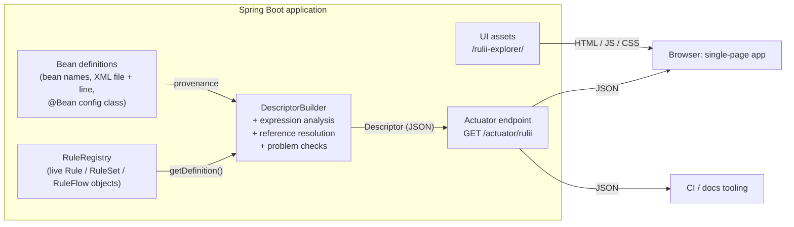

# rulii-explorer — Solution Design

Status: **approved** · 2026-09-27
Implements [REQUIREMENTS.md](REQUIREMENTS.md) (approved). Requirement IDs (FR-, NFR-, VQ-,
C-) refer to that document.

---

## 1. Overview



There are four layers, each with one job:

1. **rulii core describes itself.** Every Rule, RuleSet, RuleFlow and flow command can return
   a complete, typed *definition* of itself, including expression source text (changes C-1
   to C-4). This is the single source of truth for Java-built and XML-built artifacts alike.
2. **rulii-spring adds provenance**: bean names, the XML file and line, and the `@Bean`
   configuration class (C-5, C-6).
3. **The explorer builds the descriptor**: it walks the definitions, analyses expressions
   (plain English, binding reads and writes), resolves references, and checks for problems.
   The output is one versioned JSON document (FR-40).
4. **The UI is a client of that document.** It is a static single-page app. Everything it
   shows comes from the descriptor, so CI and documentation tools see exactly what the UI
   sees.

## 2. Key decisions

| # | Decision | Why | Rejected alternative |
|---|---|---|---|
| D-1 | **Introspection lives in rulii core**, as a `describe`/definition API on every artifact and command | Java-built and XML-built artifacts get equal detail (you chose "change freely"). One code path. | Explorer reads rulii-spring's XML parse tree: only works for XML, and needs a second path for Java |
| D-2 | **Expression analysis runs server-side** (Java, using Spring's SpEL parser) and its output goes in the descriptor | There's no SpEL parser for JavaScript. CI and docs get the plain English too. The UI stays simple. | Translating in the browser: would mean writing and maintaining a SpEL parser in JavaScript |
| D-3 | **Spring Boot Actuator endpoint** for the descriptor | Proven exposure and security model (NFR-2), works for MVC and WebFlux (NFR-11) | Plain `@RestController`: we'd have to re-create exposure and security |
| D-4 | **No-build static UI: Lit web components + plain ES modules**, with libraries copied into the project (§9) | No Node or npm in the build; Maven just packages files. The UI is read-only with small state, so it doesn't need a heavy framework. Lit components still work inside a bundler, so adding one later needs no rewrite. | React + Vite (a full Node toolchain for an ecosystem we mostly don't need); plain JS with no library (too much hand-written DOM syncing as R3/R4 grow); Cytoscape.js (less control over visual detail) |
| D-5 | **ELK for layout** (elkjs in a Web Worker), **d3 for rendering and interaction** (SVG, zoom/pan, transitions; later R4 timelines) | ELK is deterministic (FR-56) with right-angled routing, no overlaps (VQ-10) and nested groups for when/for-each/scope. d3 is the most mature toolkit for zoom, pan and transitions. | d3-force as the default layout: labels overlap edges, edges cut through nodes, and direction is lost. It may return in R2 as a whole-app "constellation" view if the design phase wants one. |
| D-6 | **Design starts fresh** with a choice between three distinct visual directions (§11) | You asked for a clean slate. Choosing between concrete options is faster than refining an abstract brief. | Iterating on the old mockup |

---

## 3. Modules and naming

Resolves open questions 2 and 3. The layout follows springdoc's pattern: one starter for
users, smaller modules underneath.

| Module | Contents | Depends on |
|---|---|---|
| `rulii-explorer-parent` | Parent POM: versions, plugins | — |
| `rulii-explorer-core` | Descriptor model (Java records), `DescriptorBuilder`, reference resolution, problem checks, JSON Schema. **No Spring.** | rulii, jackson-databind |
| `rulii-explorer-spring` | Spring provenance (bean definitions) and SpEL expression analysis. Plain Spring, **no Boot** (NFR-14). | core, rulii-spring, spring-expression |
| `rulii-explorer-ui` | The static single-page app (plain files, no build step) under `META-INF/resources/rulii-explorer/`, including the copied-in third-party libraries in `vendor/`. | — |
| `rulii-explorer-spring-boot-starter` | Auto-configuration, Actuator endpoint, UI serving. **The one dependency users add** (NFR-12). | all of the above |
| `rulii-explorer-demo` | The showcase application (VQ-50). Not published. | starter |

- **Coordinates:** `org.rulii:rulii-explorer-*:1.0.0`, Java package `org.rulii.explorer`.
  Explorer 1.0 requires rulii and rulii-spring **2.1+**, where the core changes land.
- **Endpoint:** Actuator id `rulii` → `GET /actuator/rulii`.
- **UI path:** `/rulii-explorer/` (configurable).
- **Properties:** prefix `rulii.explorer.*` (§8.2).

---

## 4. Changes to rulii and rulii-spring (M0 work list)

Checked against the current code (rulii 2.1.0-SNAPSHOT, rulii-spring 2.0.1-SNAPSHOT). Most
changes follow one pattern. The flow builder already has every piece of information at build
time (for example `WhenConstruct` holds the condition and both bodies). It just passes them
into commands as lambdas or private fields, where nothing can read them back. So most of the
work is keeping that data and exposing it. **Execution paths don't change.**

### 4.1 rulii (core) → 2.1.0

**0. Housekeeping**
- Commit the 40 uncommitted files in the working tree (validation builders,
  `DefaultBindings`) first, so these changes start from a clean base.

**1. Source locations (C-1)**
- `model/SourceDefinition.findElement`: skip `org.rulii.` frames instead of the old
  `org.algorithmx.` prefix, keeping the test-package exception. Today every recorded
  location points at `SourceDefinition.build` itself.
- Add a test that the recorded location is the caller.

**2. Keep expression text (C-3)**
- **`Script.getSourceText()`**: the text as written, before `${...}` placeholders are
  resolved. `getScript()` stays the resolved text. The descriptor only ever uses the
  unresolved text, so resolved secret values can't leak (NFR-3).
  - `ScriptBuilderBuilder.with()` currently discards the original text when it resolves
    placeholders. It will pass the original to `ScriptBuilder`, which stamps it on the
    compiled script.
  - The `ScriptCompiler` interface is unchanged, so the SpEL, GraalJS, Janino and JSR-223
    compilers need no changes.
- **New `model/ExpressionDefinition` record:**
  ```java
  public record ExpressionDefinition(
      Kind kind,                            // SCRIPT, COMPILED or COMPOSITE
      String language,                      // "el", "js", ...     (SCRIPT)
      String sourceText,                    // unresolved text     (SCRIPT)
      MethodDefinition method,              // signature           (COMPILED)
      String operator,                      // and / or / not      (COMPOSITE)
      List<ExpressionDefinition> operands   //                     (COMPOSITE)
  ) { enum Kind { SCRIPT, COMPILED, COMPOSITE } }
  ```
- **`Condition`, `Action` and `Function` each get `default ExpressionDefinition getExpression()`.**
  - `ConditionBuilderBuilder.build(Script)` currently wraps the script in an anonymous
    lambda. It will produce a condition that still holds its `Script` and reports `SCRIPT`.
    `ActionBuilderBuilder` and `FunctionBuilderBuilder` get the same change.
  - `DefaultCompositeCondition` and `NotCondition` report `COMPOSITE` with their operands.
  - Everything else reports `COMPILED` with its `MethodDefinition`. That is how FR-15's
    honest-opacity rule is served.

**3. Flow commands describe themselves (C-2)**
- New `ruleflow/definition` package. `RuleFlowCommand` gets
  `default CommandDefinition getDefinition()`, which returns `Custom(className)` unless a
  command overrides it. The types are modelled on rulii-spring's existing XML parse tree
  (which already covers every XML command), but language-neutral:

```java
sealed interface CommandDefinition {
  record Run(Target target, String as, String scope, List<Param> params, Handler handler)
  record Apply(ExpressionDefinition fn, String as, String scope, List<Param> params, Handler handler)
  record Execute(ExpressionDefinition action, Handler handler)
  record AsyncRun(Target target, String as, AsyncContextMode mode, Continuation then, Handler handler)
  record Await(Kind kind, List<String> names, Duration timeout)   // ONE / ALL / ANY
  record Bind(String scope, BindKind kind, List<BoundName> names, String label)
  record When(ExpressionDefinition condition, List<CommandDefinition> then, List<CommandDefinition> otherwise)
  record ForEach(String item, ExpressionDefinition source, ExpressionDefinition stop, List<CommandDefinition> body)
  record Scope(String name, List<CommandDefinition> body)
  record Exit(ExpressionDefinition result)                         // result may be null
  record Custom(String className, List<CommandDefinition> body)    // body for custom containers
}
sealed interface Target {
  record Instance(Runnable<?> runnable)   // resolved at build/wiring time (Java instance or XML bean-ref)
  record ByName(String name)              // late-bound registry lookup (by bean name in Spring)
  record ByClass(Class<?> type)           // late-bound registry lookup
}
record Handler(Class<? extends Exception> exceptionType, List<CommandDefinition> body)
// Bind: kind = LITERAL | OBJECT | BINDINGS | BEAN_OBJECT | LOADER | DECLARATIONS | EXPRESSION
//       BoundName(name, type, ExpressionDefinition expression): the value itself is never recorded
```

| Class | Change |
|---|---|
| `RunCommand` | Definition from its existing getters. Nothing to add. |
| `AsyncRunCommand` | Same, plus the continuation and context mode. |
| `AwaitCommand`, `AwaitAllCommand`, `AwaitAnyCommand` | Existing getters are enough. |
| `WhenCommand` | Add a getter for the condition. The otherwise-body is write-only today; make it readable. |
| `ForEachCommand` | Expose the source, element name and stop condition (private with no getters today). |
| `ScopeCommand`, `ContainerCommand` | Make `getBody()` readable (it's `protected` today). |
| `ReturningCommand` | Expose the result extractor. |
| `BindCommand`, `BindConstruct` | The biggest change. All 10 `bind`/`bindTo` overloads in `RuleFlowBuilderTemplate` build an opaque consumer. They will also record the definition: scope, kind of value, the names where known, and each value's **type**. The value itself is never recorded, because it could be a secret or a live service (NFR-3). |
| `RuleFlowExceptionHandler` | `getBody()` is package-private; make it readable. |

- **User commands can describe themselves.** A custom command can override
  `getDefinition()` to show real structure instead of "opaque". It's a small extension point
  for users.

**4. Definition completeness (C-4)**
- `RuleFlowDefinition`: add the command tree, global handler, and finalizer and returning
  expressions. Fix `resultType`: `RuleFlowBuilderTemplate` always sets it to `Object`.
- `RuleSetDefinition`: add input parameters and the error handler (today they're only on
  the live `RuleSet`). Give the stop-condition field a name that says what it is.
- `model/InputParameter`: add a `description` field, so rulii-spring can carry
  `param@description` through.

**5. Registry**
- `RuleRegistry`: add `getNames()` (or a name → artifact map). The explorer needs each
  artifact's registry key, and the list methods only return objects.
- `getRuleFlows()` currently has a default that returns an empty list. Give it a real
  default so other registries don't silently hide their flows.

**6. Validation rules**
- `ValueValidationRule.getValueName()`: make it public (it's `protected` today).
- For each validator's own settings (min/max, pattern, allowLocal and so on), the explorer
  reads the public getters on each concrete validator. No changes across the ~30 validators.

### 4.2 rulii-spring → 2.1.0 (depends on rulii 2.1.0)

**1. XML file and line (C-5)**
- `RuleRegistrar`: give its `XmlBeanDefinitionReader` a line-tracking `DocumentLoader` (a
  SAX pass records each element's line in DOM user data). Also record the resolved XML files
  in `RuleRegistrarMetaInfo`; today it only keeps the patterns.
- All five parsers (`Rule`, `ValidationRule`, `PredefinedValidationRule`, `RuleSet`,
  `RuleFlow`): set the source (resource + line) and resource description on every bean
  definition they create, including the auto-named beans for inline rules and `class-ref`.
- XML loaded any other way (`@ImportResource`, `<import>`) still gets the file, but not the
  line.

**2. Keep `param@description` (C-6)**
- `RuleSetBeanDefinitionParser.parseParam` ignores it today. It will go through
  `RuleSetFactoryBean.InputParameterDefinition` into the new `InputParameter.description`.
  The flow parser gets the same.

**3. Make sure XML produces full definitions**
- `RuleFlowFactoryBean`: go through every XML command and check it maps to a builder call
  that keeps its definition. Two known cases:
  - Expression binds need a builder overload that takes a name plus a function, if they
    currently go through a raw consumer.
  - `bind ref` and `context ref` beans should record the bean name as the label.
- Everything else comes through the core changes automatically: `bean-ref` targets become
  resolved instances (`Target.Instance`), and SpEL scripts keep their text through
  `Script.getSourceText()`. No explorer-specific code is needed in rulii-spring.

**4. Versions and docs**
- rulii-spring goes from 2.0.1-SNAPSHOT to 2.1.0-SNAPSHOT, depending on rulii 2.1.0-SNAPSHOT.
- `CLAUDE.md` is stale on two points: it says the version is 1.3.0, and its bean-name table
  leaves out the `rulii.` prefix.

### 4.3 Not in R1

- **C-7, execution tracing for R4:** events for nested flow commands, a command-start event,
  timings and correlation IDs. Also `RuleSetListener.onRuleSetInputCheck`, which is declared
  but never fired.

---

## 5. The descriptor (v1.0)

### 5.1 Shape

```jsonc
{
  "descriptorVersion": "1.0",
  "application": { "name": "order-service", "ruliiVersion": "2.1.0", "explorerVersion": "1.0.0" },
  "packages": [
    { "id": "com.acme.order.rules", "kind": "java" },
    { "id": "rules/order",          "kind": "xml" }
  ],
  "artifacts": [
    {
      "id": "minTotalRule",                       // registry key = Spring bean name
      "name": "MinTotalRule",                     // the artifact's own name (FR-4)
      "type": "rule",                             // rule | ruleset | ruleflow
      "kind": "xml-script",                       // xml-script | rule-class | java-builder | predefined-validator
      "registered": true,                         // false = inline member, not in the registry
      "package": "rules/order",
      "description": "Order total must meet the configured minimum.",
      "source": { "type": "xml", "resource": "classpath:rules/order/validation.xml", "line": 42 },
      "given": {
        "kind": "script", "language": "el",
        "text": "#ctx.order.total >= ${order.minTotal:100}",
        "plain": { "complete": true, "tokens": [
          { "t": "binding", "path": ["order", "total"], "text": "order total" },
          { "t": "op", "text": "is at least" },
          { "t": "placeholder", "key": "order.minTotal", "default": "100" } ] },
        "reads": ["order"], "writes": []
      },
      "parameters": [ { "name": "order", "type": "com.acme.Order", "optional": false } ]
    }
    // rulesets add: members (ordered ids), preCondition, stopCondition, …
    // ruleflows add: commands (the CommandDefinition tree), globalHandler, returning, …
    // validation rules add: validation { errorCode, severity, message, valueSource, settings }
  ],
  "references": [
    { "from": "orderProcessingFlow", "to": "orderValidationRules", "type": "runs",     "resolution": "direct" },
    { "from": "nightlyRepriceFlow",  "to": "rangeCheckRule",       "type": "runs",     "resolution": "by-name" },
    { "from": "orderValidationRules","to": "minTotalRule",         "type": "contains", "resolution": "direct" }
  ],
  "bindings": [
    { "name": "order", "readBy": ["minTotalRule", "…"], "writtenBy": ["orderProcessingFlow"], "unknownWriters": ["fraudScoreRule"] }
  ],
  "problems": [
    { "severity": "error", "code": "UNRESOLVED_TARGET", "artifact": "nightlyRepriceFlow",
      "path": "commands[2]", "message": "Runs 'prefixRule', but nothing with that name is registered." }
  ]
}
```

### 5.2 Rules for the contract

- **IDs** are the registry key, which in Spring is the bean name: flow `name=` lookups
  resolve by bean name (`SpringRuleRegistry.get`). Inline artifacts that aren't in the
  registry get a path ID (`orderValidationRules/members/2`).
- **Opaque parts are explicit**, never missing. They appear as
  `{ "kind": "compiled", "signature": "boolean test(Order order)" }` (FR-15).
- **Output is stable (FR-43).** Arrays are sorted by type then ID, keys are in a fixed order,
  and the body carries no timestamps. Generation time goes in the HTTP
  `Last-Modified`/`ETag` headers instead.
- **Additive within 1.x (FR-41).** The JSON Schema is published at
  `rulii-explorer-core/src/main/resources/rulii-descriptor-1.schema.json`, and CI validates
  every golden file against it.
- **Location hiding (NFR-4).** With `include-sources=false`, the `source` blocks and class
  names are omitted from the descriptor.

---

## 6. Expression analysis

It lives in `rulii-explorer-spring` behind an SPI, so other languages can be added later:

```java
interface ExpressionAnalyzer {
  boolean supports(String language);
  Analysis analyze(String sourceText);   // plain-English tokens, reads, writes, complete flag
}
```

- **SpEL (`el`)**
  1. **Placeholder pre-pass.** `${key:default}` is not valid SpEL, so each placeholder is
     replaced with a synthetic variable (`#__ph0`), parsed, then mapped back to a
     `placeholder` token.
  2. **AST walk** with `SpelExpressionParser`:
     - `#ctx.a.b` and bare `a.b` (the root object is the bindings) become a **binding read**.
     - An assignment to either becomes a **write**.
     - Operators, literals, method calls and `?:`/ternaries map to phrases through a small
       phrase book, e.g. `>=` → "is at least", `!= null` → "is present",
       `.size()` → "number of …", `matches` → "matches the pattern".
     - Identifiers are humanised: `minTotal` → "min total".
  3. **Partial fallback (FR-17).** Any node without a phrase is emitted as a `raw` token
     holding its source slice, and `complete` becomes `false`. If the parse fails completely,
     there are no tokens and the UI shows only the raw text.
- **Other languages** (e.g. rulii-js): raw text only, with no reads or writes. That's
  honest, and it fits FR-17.
- **Test corpus:** every expression in rulii-spring's XML test fixtures and in the demo app,
  with golden translations.

## 7. References and problems

- **References** come from ruleset members (`contains`) and flow `Run`/`AsyncRun` targets
  (`runs`).
  - `Target.Instance` is mapped back to an artifact ID through an identity lookup over the
    registry's objects (`direct`). That covers XML `bean-ref` and Java instances alike.
  - `ByName` and `ByClass` targets are resolved against the registry now, on a best-effort
    basis (`by-name`/`by-class`, shown as "dynamic lookup").
- **Problem checks** are small, independent classes, so adding one is easy:

| Code | Severity | Check |
|---|---|---|
| `UNRESOLVED_TARGET` | error | A `ByName`/`ByClass` target that doesn't resolve now |
| `NAME_MISMATCH_LOOKUP` | warning | A by-name lookup that matches a rule's *name* but not its bean name (a real pitfall: the bean `testRule4` holds a rule named `TestRule4`) |
| `DUPLICATE_NAME` | warning | Two artifacts with the same own name |
| `UNDESCRIBABLE` | error | Introspection of an artifact threw; it is shown with what we have (NFR-22) |
| `UNUSED_RULE` | info | A registered rule that no ruleset or flow references |
| `MISSING_DESCRIPTION` | info | No description |

---

## 8. Spring Boot integration

### 8.1 Auto-configuration

`RuliiExplorerAutoConfiguration` is registered in `AutoConfiguration.imports` and runs
after rulii-spring's `RuleConfig`. It applies only when a `RuleRegistry` bean exists and
`rulii.explorer.enabled` is true, and has three parts:

- **`RuliiDescriptorEndpoint`**: `@Endpoint(id = "rulii")` with a `@ReadOperation` that
  returns the descriptor.
  - It only becomes reachable over HTTP when the application adds `rulii` to
    `management.endpoints.web.exposure.include`. Actuator's own rules give opt-in by
    default (NFR-2).
  - It has no write operations at all (NFR-1).
- **`DescriptorService`**: builds the descriptor on first request, not at startup (NFR-21),
  and caches it together with its ETag.
  - The cache is cleared on `ContextRefreshedEvent` (which covers devtools restarts).
  - A build failure is logged and returned as an error payload. It never breaks the
    application (NFR-22).
- **UI serving**: separate MVC and WebFlux configurations, each conditional on its web stack.
  - Static assets are served under a versioned path, `/rulii-explorer/{version}/**`, with
    long-lived caching. The version in the path does the cache-busting that hashed filenames
    would do in a bundled build.
  - `index.html` is served by a tiny handler that injects the descriptor URL, which is
    worked out from the context path and actuator base path (NFR-11):
    `<meta name="rulii-descriptor" content="/app/actuator/rulii">`.
  - When Actuator runs on a **separate management port**, the UI is registered in the
    management context instead (`@ManagementContextConfiguration`), so it stays on the same
    origin as the descriptor and needs no CORS.

### 8.2 Properties

| Property | Default | Purpose |
|---|---|---|
| `rulii.explorer.enabled` | `true` | Master switch. The endpoint still needs Actuator exposure. |
| `rulii.explorer.ui.enabled` | `true` | Serve the UI. Turn it off to keep the JSON only (e.g. CI-only use). |
| `rulii.explorer.ui.path` | `/rulii-explorer` | UI location |
| `rulii.explorer.include-sources` | `true` | Include file, line and class names (NFR-4) |
| `rulii.explorer.application-name` | `${spring.application.name}` | Shown in the top bar |

### 8.3 Security

- **The descriptor is protected by whatever protects Actuator.** The docs will include a
  recommended Spring Security snippet.
- **The UI assets contain no data.** They only need to be as protected as the application
  wants.
- **The UI handles access failures.** If the descriptor returns 401, 403 or 404 (not
  exposed), the UI shows a designed state explaining what to configure.
- **Lazy beans:** describing the registry instantiates any lazy rule beans on the first
  request. That's acceptable, because rules are cheap and immutable, and it's documented.

### 8.4 Build-time descriptor (FR-44)

`RuliiDescriptors.write(ApplicationContext, Path)` can be called from any `@SpringBootTest`.
A CI job writes the descriptor and diffs it against the previous release. No extra Maven
plugin is needed for R1.

---

## 9. Frontend architecture

### 9.1 Approach: static, no build

The UI is plain files: HTML, CSS and JavaScript ES modules, loaded by the browser through an
import map. There is **no Node, npm or bundler in the build**; Maven just packages
`src/main/resources`. This works because the explorer is read-only. It loads one document,
and the app state is small: the selection, the active view, search text and preferences.

| Concern | Choice | License |
|---|---|---|
| Components | **Lit** (web components, ~6 KB, designed for use without a build) | BSD-3-Clause |
| Graph rendering and interaction | **d3**: SVG rendering, zoom and pan (d3-zoom), transitions, drag; later R4 timelines (scales, axes) | ISC |
| Graph layout | **elkjs**, run in a Web Worker | EPL-2.0 (§14) |
| Accessible widgets | Built on native platform features: `<dialog>`, the Popover API, `inert`, and ARIA patterns from the WAI-ARIA Authoring Practices | — |
| Command palette | Our own component (Ctrl/⌘ K) | — |
| Search | Our own in-memory index (field-weighted, prefix and fuzzy matching). 1,000 artifacts don't need a library. MiniSearch (MIT) is the fallback. | — |
| State | One small store module: plain JS with change events that Lit components subscribe to | — |
| Motion | CSS transitions, the Web Animations API, and View Transitions where the browser supports them (progressive enhancement) | — |
| Icons | Chosen in the design phase; inline SVG sprites | ISC/MIT |
| Fonts | Chosen in the design phase; self-hosted (NFR-13) | OFL |
| Styling | CSS custom properties from one `tokens.css`. They pass through shadow DOM, so every component shares the design system. | — |
| Types | JSDoc annotations, checked by the editor. Optionally, `tsc --checkJs` as a dev-only CI step. | — |

- **Third-party files live in `vendor/`**, pinned to exact versions and unmodified. A
  `vendor/README.md` records each file's version, source URL, license and checksum.
  Updating a library means replacing its file.
- **Size:** there's no minification of our own code, which is fine with gzip. Lit and d3 are
  about 100 KB gzipped together. elkjs (~300 KB gzipped) loads only when a graph first
  opens.
- **Escape hatch:** Lit components work unchanged inside a bundler. If the project outgrows
  no-build (many contributors, a need for real TypeScript), Vite can be added later without
  rewriting anything.
- **Known future cost (R3):** a rich code or JSON editor (e.g. CodeMirror 6) is impractical
  without a build. If R3 needs one, we build it once and copy the output into `vendor/`.

### 9.2 Structure

```
rulii-explorer-ui/src/main/resources/META-INF/resources/rulii-explorer/
  index.html        import map, app shell
  app/
    design/         tokens.css, themes, typography, motion presets
    components/     design-system primitives (rx-button, rx-badge, rx-card, rx-chip, rx-tooltip, ...)
    descriptor/     JSDoc typedefs for the descriptor; loader; indexes
    state/          store: descriptor, selection, view, preferences
    features/
      shell/        top bar, sidebar (type → package tree), command palette
      overview/     landing page: counts, packages, problems (FR-33)
      artifact/     detail views per type, expression renderer (plain / raw)
      graph/        dependency graph: focus and whole-app modes
      flow/         flowchart + outline
      problems/     problems list
    graph-engine/   layout interface, ELK adapter + worker, d3 SVG renderer, minimap
    routing/        hash routes: #/rule/{id}?view=graph (FR-34, FR-54)
  vendor/           lit/, d3/, elk/ (+ README.md with versions and licenses)
```

- **Descriptor types are hand-written JSDoc typedefs** that mirror the JSON Schema. The
  golden-file tests (§10) load real descriptors in the browser, which catches drift between
  the typedefs and the contract.
- **Indexes are built once on load:** by ID, backlinks ("used by"), binding readers and
  writers, and the search index. Every view reads the indexes, and nothing re-scans the
  descriptor.

### 9.3 Graph rendering

- **Layout sits behind a small interface.** Graph data goes in (nodes, edges, groups, sizes)
  and positions plus edge routes come out. ELK is the only implementation, so it could be
  replaced later (e.g. with the MIT-licensed dagre) without touching the renderer.
- **Rendering:** d3 draws the laid-out graph as SVG. Pan and zoom transform one group, which
  keeps it smooth. Hover and selection states are class changes, not re-renders. Node
  labels are measured before layout so ELK can place them without overlaps.
- **Dependency graph**
  - **Focus mode (default, FR-51):** ELK layered layout, left to right: flows → rulesets →
    rules. It shows the selected artifact plus one hop, and can be expanded a hop at a time.
  - **Whole-app mode:** ELK compound nodes group the graph by package.
- **Flowchart**
  - ELK layered layout, top to bottom, with orthogonal routing (VQ-10).
  - `when`, `for-each` and `scope` are compound nodes.
  - `async-run` steps sit in their own ELK partition (the async lane), with a join edge to
    the matching `await`.
  - Exception handlers attach to their step as side branches.
- **Stable layout (FR-56):** input is sorted before layout, so ELK produces the same result
  every time. Layouts are cached per view and selection, so switching back is instant.
- **Performance (VQ-12):**
  - Layout runs off the main thread.
  - Only elements in view are drawn at full detail; labels are simplified when zoomed out.
  - A spike in M1 proves 500 visible nodes at 60 fps before we build on it (§12). The
    fallback is drawing edges on a canvas under the SVG nodes.
- **Export (R2)** is nearly free, because the renderer's output *is* SVG.

### 9.4 Expression rendering

- **Plain English by default.** The UI renders the descriptor's `plain.tokens`: bindings and
  placeholders become styled chips with hover cards, and `raw` tokens use monospace.
- **Raw on demand.** A toggle per expression, and a global one, shows `text` with syntax
  highlighting (FR-14, FR-17). The browser remembers the choice.

---

## 10. Testing and quality gates

| Layer | What | Tooling |
|---|---|---|
| Core changes | Definitions for every command and expression kind; SourceDefinition caller location | JUnit 5 (existing rulii conventions) |
| Descriptor | **Golden files**: descriptors built from rulii-spring's XML fixtures and the demo app are compared to checked-in JSON and validated against the schema | JUnit 5 + JSON Schema validator |
| Expression analysis | Golden translations for the whole expression corpus | JUnit 5 |
| Boot integration | Endpoint exposure/non-exposure, MVC vs WebFlux, context path, separate management port, security 401/403 | `@SpringBootTest` matrix |
| UI units | Indexes, search, expression renderer, routing, layout adapter; descriptor typedefs checked against the golden descriptors | A small in-browser test page (our own minimal runner, ES modules), driven headless from JUnit by **Playwright for Java** |
| **Visual regression (VQ-52)** | Every screen and state, light and dark, at desktop and tablet widths, against the demo app | Playwright for Java screenshots, run from JUnit in CI |
| Accessibility (NFR-31) | Automated checks on every screen, plus a keyboard-only pass | axe-core (a test-only file in `vendor/`, never shipped) injected by Playwright for Java; a manual pass before release |
| Scale (NFR-20, VQ-12) | A generated app with 1,000 artifacts: descriptor build time, search latency, graph frame rate | JMH-lite timing test; Playwright performance trace |

---

## 11. Design process (fresh start)

Design is a gated track that runs in parallel with the backend work (VQ-51):

1. **Direction exploration.** Three clearly different visual directions, each shown as the
   same two hi-fi screens (the overview and a flowchart with the detail panel), using real
   demo data, in light and dark. **All three use the rulii brand (§11.1)**. They differ in
   layout, density, typography and how strongly the brand is applied, for example:
   - *brand-forward:* deep-purple chrome like the rulii.com navigation, with orange highlights
   - *light and calm:* the lavender surface leads, and the brand appears as accents
   - *neutral professional:* a quiet grey canvas, with the brand kept to the logo, selection
     and key actions

   You pick one, or combine them.
2. **Design system.** Tokens built on the brand palette: tints and shades, a designed dark
   theme, and a colour-blind-validated categorical palette for artifact types (extending the
   brand hues where needed); type scale; spacing; radii; elevation; motion. Also the icon
   style, the SVG logo, and the node and edge visual language.
3. **Screens.** Hi-fi designs for every R1 screen and state (loading, empty, error, not
   exposed, problems). Each is approved before it's built.

The designs are delivered as interactive HTML prototypes built on the same tokens the real
UI uses, so what gets approved is what gets built.

**Direction chosen (2026-09-27):** B · Lavender as originally drawn: Newsreader + Hanken
Grotesk + JetBrains Mono, lavender ground, white cards, deep-purple ink, orange as small
accents, plain English first, and B's original (airier) density. A compact variant at
C · Graphite's density was tried and not chosen. Every page uses the same light colour
scheme by default. The dark theme stays available, in its softer form: lifted grounds
(page `#221433`, bars and panels `#291A3D`, cards `#2F2045`) rather than near-black. The explorations
are on the design canvas: https://claude.ai/artifact/PBLj4xrfvm7noBZ7o6KWs4

**M2 complete (2026-09-28):** the design system and hi-fi designs of every R1 screen and
state were approved. Everything is in [`/design`](../design/README.md): `tokens.css` (the
single source of truth the UI loads), `DESIGN-SYSTEM.md`, the logo in `brand/`, the brief
with the demo data, and the source of every canvas artboard in `canvas/`.

### 11.1 rulii brand palette (from rulii.com)

Taken from the site source (`rulii-docs/tailwind.config.js`, which matches the live CSS) and
sampled from the logo images in `rulii-docs/assets/images/`.

| Token | Value | Where rulii.com uses it |
|---|---|---|
| `brand-deep` (secondary) | `#301549` | Navigation bar, footer, logo background |
| `brand` (primary) | `#452C5B` | Hero band, buttons, active tabs, headings |
| `brand-accent` | `#F97316` | Call-to-action button, highlighted text |
| `logo-orange` | `#F5841D` | Logo arcs and the first "i" dot |
| `logo-pink` | `#E64E6D` | Middle of the logo's arc gradient |
| `logo-purple` | `#833EAE` | Logo arcs and the second "i" dot |
| `brand-surface` | `#FAF5FF` | Light lavender page sections |
| `code-bg` | `#1A0E2E` | Code blocks |
| `code-text` | `#A9B7C6` (comments `#808080`) | Code block text |
| Code font | JetBrains Mono → Fira Code → Consolas | All code |
| UI font | Tailwind's default system sans stack | Body text |

The logo is on a `#301549` ground: arcs with an orange → pink → purple gradient, and a white
"rulii" wordmark with orange and purple dots over the i's.

**Contrast checks (WCAG AA needs 4.5:1 for normal text):**

| Pair | Ratio | Result |
|---|---|---|
| `#452C5B` on white | ~11.9:1 | Pass: fine for text and buttons |
| `#833EAE` on white | ~6.4:1 | Pass |
| `#F97316` on `#301549` | ~5.6:1 | Pass: orange works well on the deep purple |
| `#F97316` on white (or white on `#F97316`) | ~2.8:1 | **Fail** for text. On light backgrounds orange is used for non-text accents only, and a darker orange shade is used where it has to carry text (VQ-5). |
| `#833EAE` on `#301549` | ~2.5:1 | **Fail** for text. The dark theme needs a lighter purple tint for text. |

**Notes:**
- rulii.com has no dark theme. The explorer's dark theme is derived from the brand's own
  dark purples (`#301549`, `#1A0E2E`), which suit it naturally.
- The Spring pages of the site use a variant (`primary #7C3AED`, `secondary #2D1B4E`).
  **Decided 2026-09-27:** the explorer uses the main rulii palette above.
- **Logo:** redrawn as SVG from the PNGs (2026-09-27), in [`/design/brand`](../design/brand/README.md):
  the full logo, on-dark and on-light transparent versions, and a square mark for the
  favicon.

## 12. Delivery plan

| Milestone | Content | Exit criterion |
|---|---|---|
| **M0 Core** | C-1 to C-6 in rulii 2.1.0 and rulii-spring 2.1.0 | Every artifact and command in the rulii-spring fixtures describes itself fully |
| **M1 Descriptor** | Explorer modules, descriptor, expression analysis, problems, endpoint, demo app; **graph performance spike** | `curl /actuator/rulii` on the demo app returns the full descriptor; golden tests pass; spike hits 60 fps at 500 nodes |
| **M2 Design** *(parallel with M0–M1)* | Directions → design system → hi-fi screens | Your approval at each gate |
| **M3 UI foundation** | Shell, tokens, sidebar, overview, detail views, expressions, search, command palette, routing | Screens match the approved designs; visual tests are running |
| **M4 Graphs** | Dependency graph (focus and whole-app), flowchart + outline, shared selection | FR-50–56 and VQ-10–13 met on the demo app |
| **M5 Hardening** | Accessibility audit, scale test, usability check with a non-developer, docs, release | Every R1 MUST met → **rulii-explorer 1.0.0** |

## 13. Risks

| Risk | Mitigation |
|---|---|
| Graph smoothness at 500 nodes (VQ-12) | Spike in M1 before we commit. Fallback: canvas-rendered edges, or clustering by package earlier than R2. |
| Plain English reads awkwardly for complex expressions | Partial translation with raw fallback. The golden corpus grows with every awkward case. The raw view is always one click away. |
| elkjs is EPL-2.0 (weak copyleft, file-level) | Allowed in open-source and commercial editions, with the rules in §14. Layout sits behind an interface (§9.3), so ELK could be replaced if that ever became necessary. |
| Hand-built accessible widgets (no component library) | Follow the WAI-ARIA Authoring Practices patterns, use native `<dialog>` and Popover where possible, and cover every widget with automated axe checks plus a keyboard-only pass. |
| Core changes touch hot paths (commands, conditions) | Definitions are built from data the builder already has, so execution paths don't change. rulii's existing test suite guards them. |
| Explorer 1.0 needs rulii 2.1 | The explorer releases together with or after rulii 2.1. It fails fast with a clear message on older versions. |

## 14. Third-party licensing

### 14.1 Shipped dependencies

| Library | License | Kind | Obligations |
|---|---|---|---|
| Lit | BSD-3-Clause | Permissive | Keep the copyright notice and license text |
| d3 | ISC | Permissive | Keep the copyright notice and license text |
| elkjs | EPL-2.0 (secondary license GPL-3.0+, irrelevant to us) | Weak copyleft, file-level | The rules in §14.2 |
| Fonts (TBD) | SIL OFL 1.1 | Permissive for bundling | Keep the license; the fonts may be bundled in commercial products, but not sold on their own |
| Icons (TBD) | ISC or MIT | Permissive | Keep the notice |

Test-only dependencies (Playwright for Java, Apache-2.0; axe-core, MPL-2.0) are never
shipped, so they place no obligations on distributions.

### 14.2 Rules for ELK (EPL-2.0)

These apply to the open-source explorer and equally to any future commercial edition of
rulii or the explorer. Under EPL-2.0, code that only *uses* ELK is not a "Modified Work",
so the explorer's own code stays under whatever license we choose.

1. **Ship ELK unmodified**, as its own file (`vendor/elk/elk-worker.min.js`). Never copy ELK
   code into our own files. If we ever change ELK itself, those changes must be published
   under EPL-2.0.
2. **Keep ELK's notices**, and include the EPL-2.0 license text in the third-party notices
   file (§14.3).
3. **Say where ELK's source can be obtained**: a link to the elkjs repository at the version
   shipped, in the notices file.
4. **No license of ours may restrict anyone's rights to ELK itself.** A commercial license
   covers our code only. Any warranty is our own, not the ELK authors'.
5. **Commercial distribution (EPL-2.0 §4):** if a customer claims damages over promises made
   in our commercial offering, we indemnify the ELK contributors. This is standard for
   commercial software.

### 14.3 How it's enforced

- **`THIRD-PARTY-NOTICES.md`** at the root of the `rulii-explorer-ui` jar (and repo) lists
  every shipped library with its version, license, copyright, source URL and full license
  text.
- **`vendor/README.md`** records each file's version, source URL and SHA-256 checksum. A
  unit test checks the checksums, so an accidentally modified vendor file fails the build
  (rule 1).
- **Adding a dependency** requires a row in §14.1. Strong-copyleft licenses (GPL, AGPL) are
  not allowed in shipped code.

### 14.4 Commercial edition of rulii itself

Separate from ELK: rulii and rulii-spring are Apache-2.0. A commercially licensed edition
is possible for code Max owns. Before relicensing, any code from other contributors needs
their agreement, and a contributor license agreement (CLA) should cover future
contributions.

This section is not legal advice. Before a commercial launch, have a lawyer review the
third-party notices and the license terms.

## 15. Decisions I need from you

1. ~~Modules and naming (§3)~~ **Agreed 2026-09-27:** four published modules plus the demo,
   the `/actuator/rulii` endpoint, the `/rulii-explorer` path, and `rulii.explorer.*`
   properties.
2. ~~Core changes (§4)~~ **Agreed 2026-09-27:** the §4 work list is the M0 scope.
3. ~~Frontend stack (§9.1)~~ **Agreed 2026-09-27:** option B, a static no-build UI with Lit,
   d3 and ELK, with the licensing rules in §14.
4. ~~Design process (§11)~~ **Agreed 2026-09-27:** three directions (all on the rulii brand),
   then the design system, then approved screens.

All solution decisions are made. Next: implementation, starting with M0 (core changes) and
M2 (design) in parallel.
